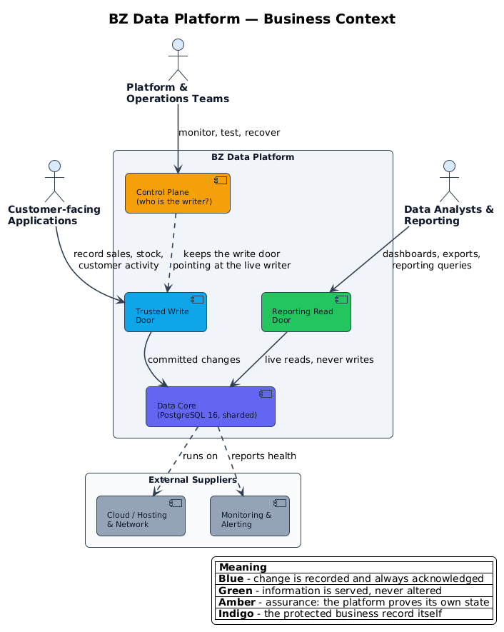
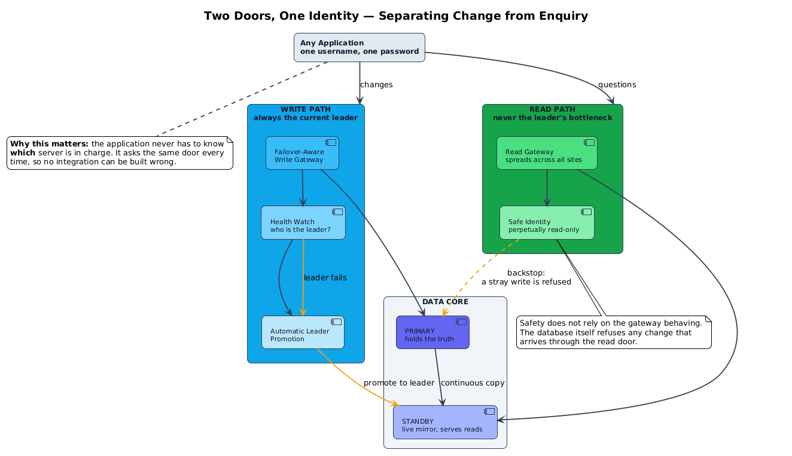
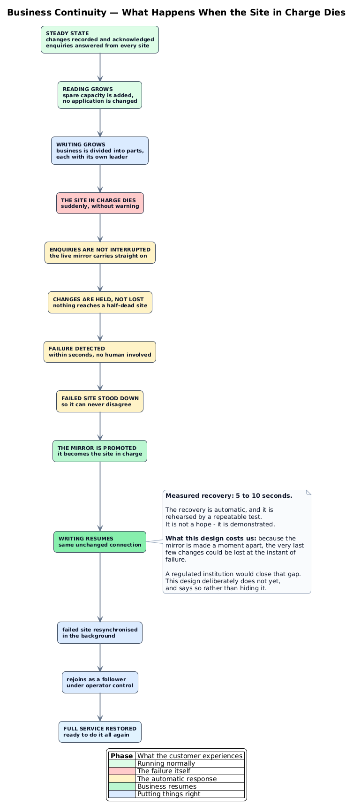
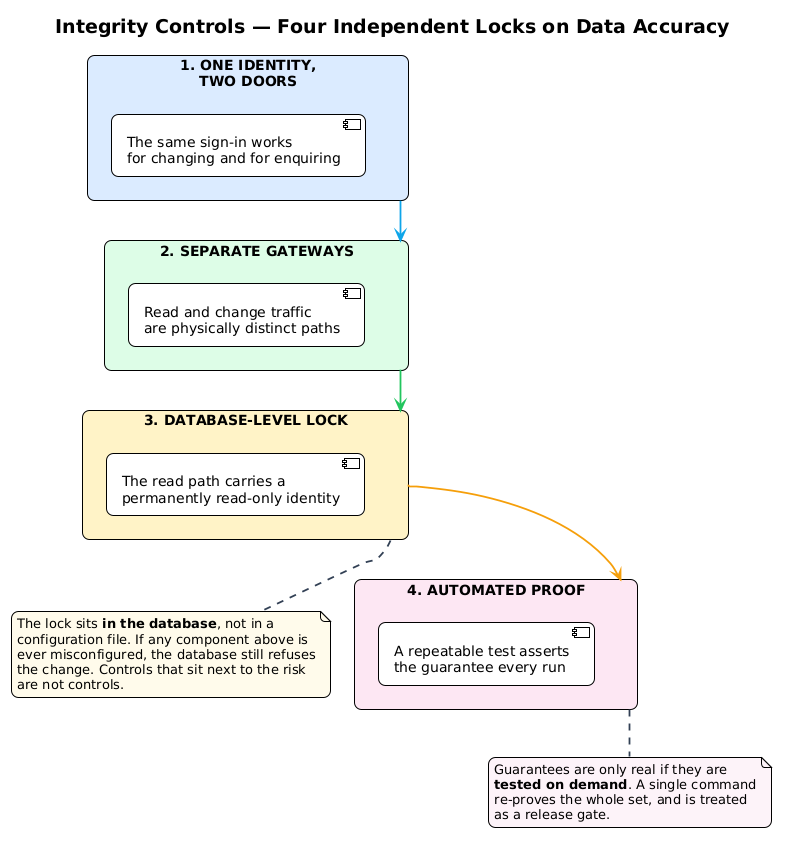
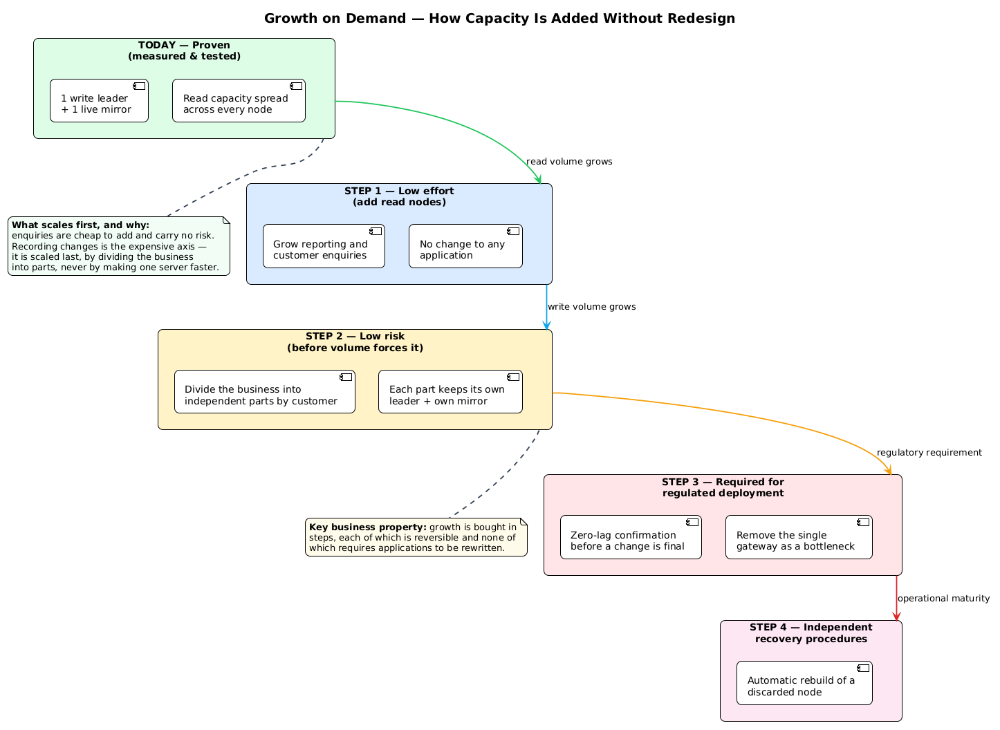
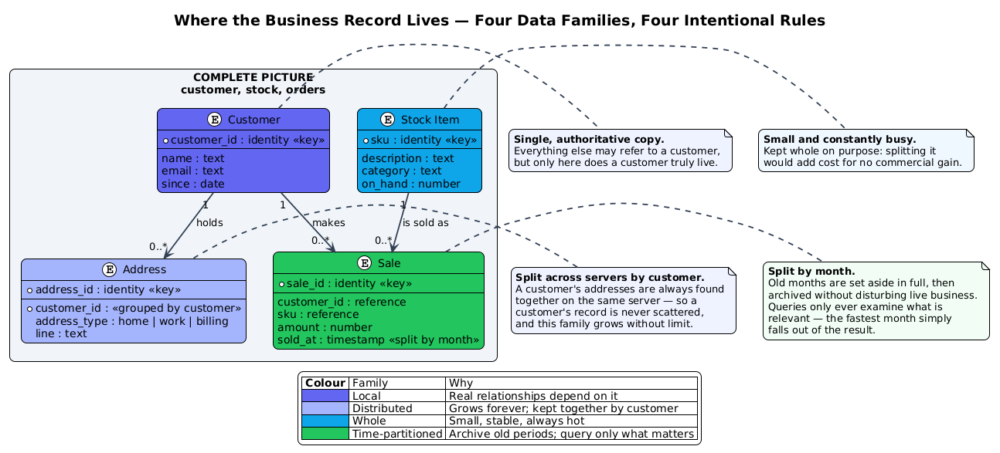

# Data Platform — Business Overview


- **Audience:** executives, product owners, risk & audit, operations
- **Companion document:** [`README.md`](../README.md) — the technical build and operating manual
- **GIT Repo** [Scalable_HA_PostgreSQL](https://github.com/georgelza/Scalable_HA_PostgreSQL)
- **Blog** [Scalable / Highly Available PostgreSQL Platform](https://medium.com/@georgelza/scalable-highly-available-postgresql-platform-b8e602de2054?postPublishedType=initial)
---

## 1. In one paragraph

BZ is the system that holds the business's own record — customers, stock and sales —
and keeps it available and correct. It is deliberately designed around three
questions a business always has to answer honestly:

1. **If the main computer fails right now, do we stop trading?** Answer: no. The
   platform hands over automatically in **5 to 10 seconds**, and that figure is
   measured, not claimed.
2. **Can anything quietly alter data that was only meant to be read?** Answer: no.
   Four independent locks stand in the way, and the strongest one lives *inside the
   database*, where it cannot be bypassed by a misconfiguration.
3. **When the business grows, do we rip it out and rebuild?** Answer: no. Capacity
   is added in reversible steps, none of which requires applications to be rewritten.

Everything below explains those three answers in business terms.

---

## 2. The shape of the service



Three groups of people use BZ, and the platform treats them differently on purpose:

| Who | What they need | What BZ gives them |
|:--|:--|:--|
| **Customer-facing applications** | Changes to be recorded and acknowledged | A single **write door** that always points at whichever site is currently in charge |
| **Data analysts & reporting** | Fast answers, never at the expense of trading | A **read door** that spreads enquiries across every site |
| **Platform & operations** | Confidence the platform is telling the truth | A **control plane** that constantly proves who is in charge, and a repeatable test that re-proves the whole thing on demand |

The three who benefit most are the ones you rarely hear from: the customer whose
payment went through during an outage, and the analyst whose report did not queue
behind live trading.

---

## 3. Capability 1 — Two doors, one identity



This is the single most important design decision in the platform, and it is worth
explaining carefully because it is counter-intuitive.

**The problem it solves.** Every system that reads from the database at the same
time as it writes to it eventually suffers one of two failures: reporting queries
slow down live trading, or — far worse — somebody's reporting job gains the ability
to change data. Both failures come from the same root cause: reading and changing
are treated as the same activity.

**What we did.** We split them into two physically separate entrances, a **write
door** and a **read door**.

**The part that surprises people.** Both doors use *the same username and the same
password*. An earlier design gave each door its own identity, which meant every
developer had to remember which identity applied to which door. That is exactly the
kind of thing that fails quietly — a copied connection string, a slightly wrong
config file, and a broken or unsafe integration that nobody notices for months.
One identity removes that entire class of mistake.

**How the read-only guarantee actually holds.** Not because the gateway is careful.
A business cannot afford a control that depends on a component behaving. So the read
door carries an identity that the *database itself* treats as permanently
read-only, and a change arriving through that door is refused by the database. If
the gateway were entirely misconfigured tomorrow, the data would still be protected.

> **The principle:** controls belong next to the risk they manage, not next to the
> team that owns them.

---

## 4. Capability 2 — Reporting never slows down trading

Reporting and analysis are almost always the first thing to grow faster than the
business expects. BZ handles that by **spreading enquiries across every site,
including the live mirror**, rather than letting them all queue behind the one site
doing the writing.

The practical effect: a month-end reporting run, a new dashboard, or an export of
customer history happens *alongside* live trading rather than instead of it.

**An honest caveat.** Spreading works best when many people are querying at once.
Sequential traffic — one query at a time from a single process — naturally reuses
one warm connection and lands on one site. This is a property of how connection
pooling works, not a defect, and it is documented in the technical README rather
than glossed over.

---

## 5. Capability 3 — The business keeps trading through a failure



This is the capability that most directly protects revenue and customer trust.

**What happens when the site in charge dies:**

- **Enquiries are not interrupted at all.** The live mirror is already answering
  them, so nobody notices.
- **Changes are held, not lost.** For a few seconds the platform refuses to write
  rather than send a change to a site that is failing — because a change accepted
  and then lost is far worse than a change that was delayed.
- **The mirror is promoted** and becomes the site in charge.
- **Writing resumes through the same unchanged connection.** No application change,
  no redeployment, no runbook followed at 3am.
- The old site is stood down, resynchronised, and rejoins as a follower.

**Recovery time: 5 to 10 seconds, measured.** There is an automated test that
kills the site in charge on demand and times the recovery. It is part of the normal
operating routine, not an exercise conducted once and forgotten.

### What we are deliberately not claiming

Because the mirror is updated a moment after the original, the very last few
changes could be lost in the instant of failure. **This is a known and stated
limitation, not a hidden one.**

A regulated institution would normally close this gap by refusing to confirm a
change until a second copy had acknowledged it — trading a small amount of speed
for the guarantee that nothing is ever lost. That step is deliberately **not** in
this design yet, and the decision to make it belongs to risk and compliance, not to
engineering. It is on the roadmap as Step 3 in §7.

---

## 6. Capability 4 — Four independent locks on data accuracy



No single control is trusted. Four operate independently, so the failure of any one
of them does not put the data at risk.

| # | Lock | What it prevents |
|:--|:--|:--|
| 1 | **One identity, two doors** | A developer guessing which door they are on, and building the wrong thing |
| 2 | **Separate gateways** | Reporting load competing with live trading for the same resource |
| 3 | **Database-level read-only identity** | *Any* accidental or malicious change through the read door — enforced by the database, not by configuration |
| 4 | **Automated proof** | A guarantee that quietly stopped being true after an unrelated change |

**On control 4 specifically.** A guarantee nobody checks is a hope. A single
command re-proves the entire set — topology, routing, and the read-only
behaviour — and it is treated as a gate before a release, not an occasional
convenience.

**The test that matters most.** The design team deliberately killed the site in
charge during testing, and found a configuration that *looked* correct, ran without
error, reported success — and promoted nothing. This is precisely why control 4
exists. A process that exits cleanly is not evidence that it worked.

---

## 7. Capability 5 — Growth without a rewrite



Capacity is bought in **reversible steps**, cheapest and lowest-risk first.

| Step | What we add | Business effect | Risk |
|:--|:--|:--|:--|
| **Today** | One site in charge + one live mirror | Continuity proven end to end | Low — measured |
| **1** | More read sites | Serving more enquiries and reporting | **Very low** — no application change |
| **2** | Divide the business into independent parts by customer | Serving far more changes than one site ever could | Moderate — do it before volume forces it |
| **3** | Confirm a change only once a second copy has it | **Zero loss of acknowledged data** | Requires a decision on speed |
| **4** | Automatic rebuild of a discarded site | Recovery becomes routine, not a project | Operational maturity work |

**The key business property:** each step can be taken, measured, and if it does not
work, reversed — and **not one of them requires applications to be rewritten.**

**Why reads scale first.** Enquiries are cheap to add and carry almost no risk.
Recording changes is the expensive axis, so it is scaled *last* — by dividing the
business into independent parts, never by making one machine faster. Sharding a
single machine harder has a ceiling; dividing the business does not.

---

## 8. Capability 6 — Data arranged by how the business actually grows



The business record is arranged into four families, each stored in the way that best
fits how it changes. These are not technical preferences; each one follows from a
commercial reality.

| Family | How it is stored | The commercial reason |
|:--|:--|:--|
| **Customer** | Whole, single authoritative copy | Everything else refers to a customer. A customer's true identity must exist in exactly one place. |
| **Address** | Split across servers, grouped by customer | This family grows forever. Grouping by customer means a customer's addresses are always found together — the record is never scattered. |
| **Stock** | Kept whole | Small, stable, always in demand. Splitting it would add cost for no commercial gain. |
| **Sale** | Split by month | Old months are set aside whole and archived without disturbing live trading. A query only ever examines the relevant months, so the answer arrives faster. |

**The principle:** data that grows without limit is prepared to be divided; data
that is small and always needed is deliberately kept whole.

---

## 9. What we have today, in numbers

| Measure | Result | Basis |
|:--|:--|:--|
| Business interruption when the site in charge fails | **None reported** | Live mirror serves enquiries throughout |
| Time before writing resumes | **5–10 seconds** | Automated failover, timed by repeatable test |
| Acknowledged changes lost at the moment of failure | **Possible** — last few only | Stated limitation, Step 3 on the roadmap |
| Protection against change via the read door | **Four independent locks** | One enforced inside the database |
| Guarantee verification | **One command, on demand** | Treated as a release gate |
| Application changes needed to scale | **None, through Step 2** | Growth by configuration and division, not rewrite |

---

## 10. Known limits and what we would do next

Stated plainly, because a design that hides its limits is not a design we would
rely on.

| # | Limit | Business consequence | Next step |
|:--|:--|:--|:--|
| 1 | The write door is a single point of failure | If that one component dies, trading stops even though the database is perfectly healthy | Run two of them behind a load balancer so there is no single point of failure |
| 2 | A discarded site cannot yet be rebuilt automatically | Recovery from a failed failover is a manual task for an operator | Automate the rebuild (Step 4) |
| 3 | Acknowledged changes can be lost in the instant of failure | A very small but non-zero financial exposure | Two-copy confirmation (Step 3) — **a risk/compliance decision, not an engineering one** |
| 4 | The business is not yet actually divided into parts | Write capacity still has a ceiling | Divide by customer (Step 2), before volume forces it |
| 5 | Manual recovery steps are not yet written as a rehearsed routine | Recovery quality depends on the individual operator | Produce and rehearse a recovery runbook |

**The single most important caveat on limit 2:** a site that was in charge when it
failed must **not** simply be switched back on. It comes back believing it is still
in charge, which puts two sites into conflict over the same data. It must be
discarded and rebuilt. This is the one operational instruction in the whole system
where "just restart it" is actively the wrong answer, and it is called out here in
bold because it is the mistake most likely to be made under pressure.

---

## 11. The five things to remember

1. **Trading continues through a failure** — automatically, in 5 to 10 seconds,
   through the same connection.
2. **Reporting never slows down trading**, because they are physically separate.
3. **Data cannot be changed through the read door**, and the strongest guarantee
   lives inside the database.
4. **Growth is bought in reversible steps**, none of which require rewriting
   applications.
5. **The limits are stated, measured and owned** — including the one that requires
   a business decision rather than an engineering fix.

---

## Appendix — Diagrams and how to reproduce them

All graphics are generated from the PlantUML sources beside them. To regenerate:

```bash
cd docs/diagrams
for f in *.puml; do
  curl -s -X POST https://kroki.io/plantuml/png \
    -H "Content-Type: text/plain" --data-binary "@$f" -o "${f%.puml}.png"
done
```

| Diagram | Source |
|:--|:--|
| Business context | [`01-business-context.puml`](diagrams/01-business-context.puml) |
| Two doors, one identity | [`02-two-door-model.puml`](diagrams/02-two-door-model.puml) |
| Business continuity | [`03-failover-journey.puml`](diagrams/03-failover-journey.puml) |
| Integrity controls | [`04-integrity-controls.puml`](diagrams/04-integrity-controls.puml) |
| Growth on demand | [`05-growth-capacity.puml`](diagrams/05-growth-capacity.puml) |
| Data families | [`06-data-families.puml`](diagrams/06-data-families.puml) |

---
*End of Document*